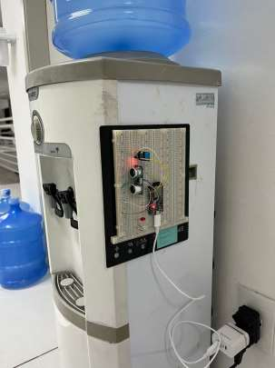
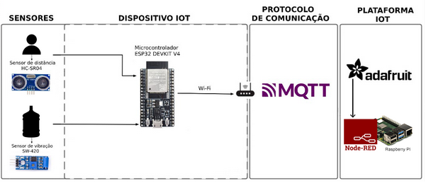
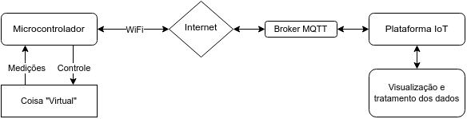
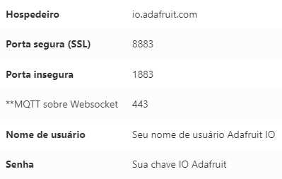
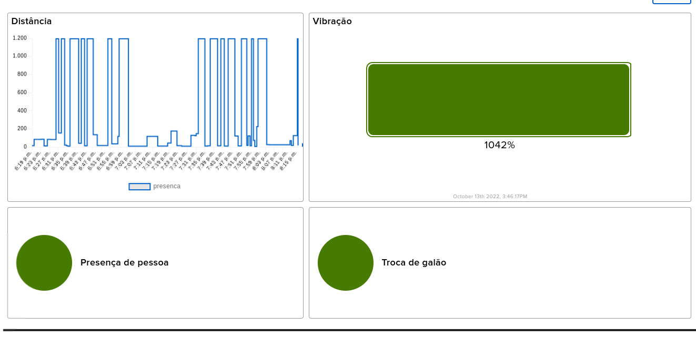
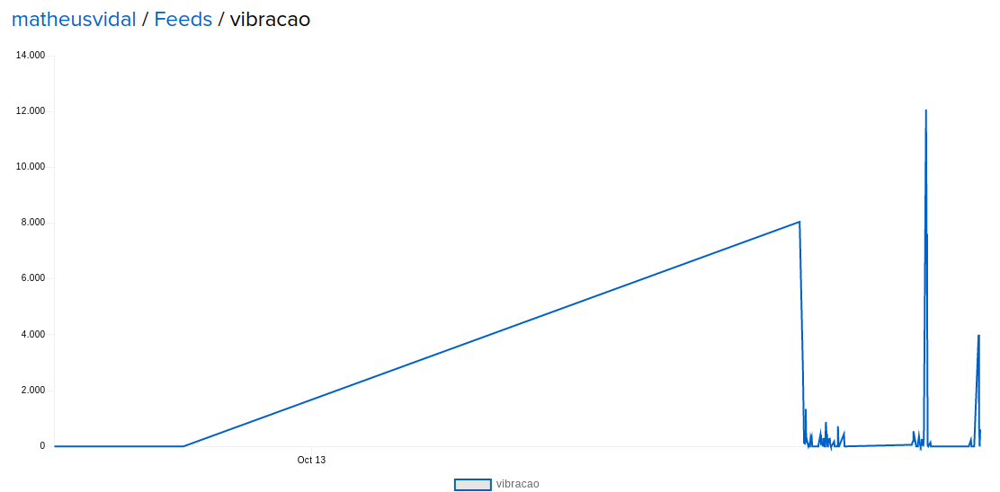
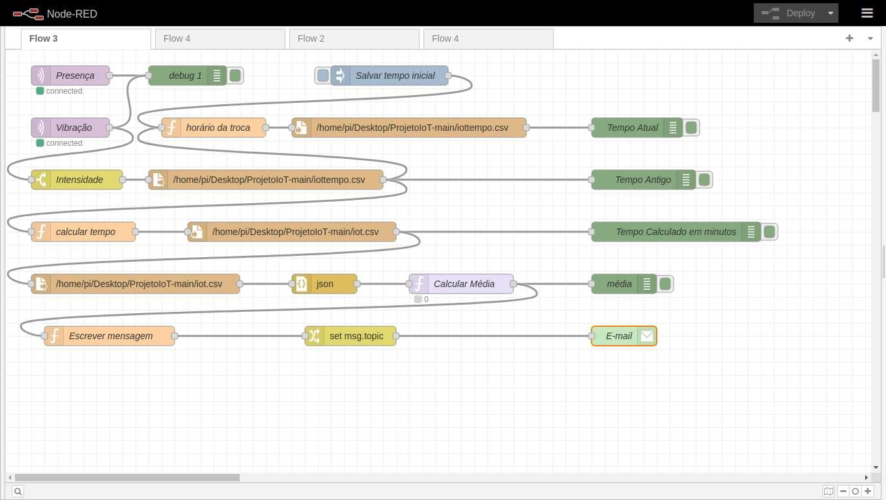
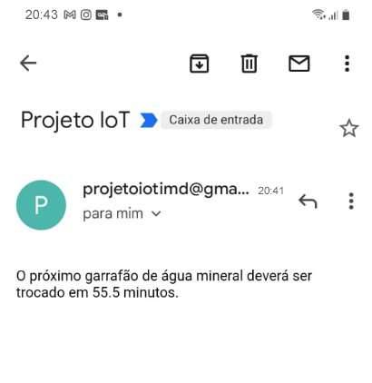

# Monitoramento de Bebedouro IoT

Disciplina: IMD0902 - Internet das Coisas - 2022.2  
Orientador: Prof. Heitor Medeiros Florencio  
Universidade Federal do Rio Grande do Norte  

## Índice

- 💡 [Descrição do projeto](#-descrição-do-projeto)
- 🎯 [Introdução](#-introdução)
- 🏗️ [Arquitetura](#-arquitetura)
- 📈 [Metodologia](#-metodologia)
- 🖥️ [Dispositivos IoT](#-dispositivos-iot)
- 📡 [Conectividade](#-conectividades)
- 🌐 [Plataformas, Aplicações e Serviços](#-plataformas-aplicações-e-serviços)
- 📊 [Resultados e discussões](#-resultados-e-discussões)

## 💡 Descrição do projeto:

O projeto tem como objetivo monitorar algum ambiente através da captação de algumas variáveis. Como ponto inicial, decidiu-se que a meta do projeto seria entender o comportamento das pessoas no IMD em relação à água potável. Esse projeto consistiu na realização do monitoramento de um bebedouro de água através de um dispositivo IoT, que foi construído com um microcontrolador ESP32 DEVKIT V4 atrelado a dois sensores: Vibração e Presença, pelos quais, se tornou possível detectar a troca de galão e a presença de pessoas bebendo água. Seguindo, os dados foram transportados para internet via WiFi ao broker MQTT do AdaFruit, que foi escolhido como plataforma IoT.

  
  

 Figuras 01 e 02 - Imagens do monitoramento na universidade. 

## 🎯 Introdução:

Esse projeto consiste no monitoramento de um bebedouro de água – a Coisa – o ambiente escolhido foi o Instituto Metrópole Digital. A problemática a ser resolvida é entender o comportamento dos alunos e funcionários do IMD em relação à água potável, assim, conseguimos perceber quantas pessoas beberam água e quais foram os horários com maior fluxo. Além disso, saber a quantidade de trocas de galões no intervalo monitorado para reconhecer quantos litros foram consumidos pelas pessoas. Com o monitoramento foi possível recolher os dados de quantas pessoas usaram o bebedouro e quantas vezes ocorreu a troca do galão de água. Após o desenvolvimento do código para a parte lógica e recebimento de dados, o projeto usou fisicamente: Um protoboard (matriz de contato), um ESP32 DEVKIT V4, um sensor de distância (HC-SR04), um sensor de vibração (SW 420), e um Raspberry PI. Além disso, para enviar os dados das variáveis foi utilizado os protocolos de comunicação: WiFi (protocolo físico) e um broker MQTT atrelado a plataforma IoT.

## 🏗️ Arquitetura:

A aplicação tem como núcleo da sua arquitetura o microcontrolador ESP32 DEVKIT V4, no qual estão conectados dois sensores: o sensor de distância HC-SR04 e o sensor de vibração SW-420. Os dados do sensor de distância são usados para computar a quantidade de pessoas que bebem água no bebedouro monitorado, já os dados do sensor de vibração são usados para contabilizar a quantidade de galões trocados. Os dados captados dos referidos sensores são transmitidos para a internet através da placa WiFi do microcontrolador ESP32. O protocolo de comunicação adotado foi o Message Queuing Telemetry Transport (MQTT) embutido na plataforma IoT. O AdaFruit IO foi a plataforma IoT escolhida para receber e armazenar os dados, que são apresentados em Dashboards. Após isso, o Raspberry PI foi utilizado para o recebimento de dados no broker e tratá-los, fazendo o cálculo da média de tempo em que ocorre a troca de galão, e enviando um aviso que a água está acabando para o email do suporte do IMD. A figura abaixo apresenta o esquema da arquitetura IoT no projeto em forma de diagrama:

  

 Figura 03 - Esquema da arquitetura de projeto IoT. 

## 📈 Metodologia:

A metodologia para o desenvolvimento do projeto foi um processo fundamental para que o mesmo fosse concluído como o esperado. Os requisitos funcionais solicitados para o projeto foram: realizar a leitura das variáveis dos sensores – distância e vibração–; calcular os níveis de atividade no ambiente, ou seja, realizar cálculos com os dados para transformá-los em informação que será enviada; armazenar as variáveis monitoradas em memória interna, registrar falhas no recebimento dos dados dos sensores, enviar os dados para um broker MQTT e fornecê-los a alguma aplicação IoT. Além disso, foi necessário reunir recursos físicos para a construção do dispositivo.
O projeto abrangeu diversos processos de construção até ser concluído, os métodos permitiram organizar e sistematizar a execução do projeto. A metodologia cascata foi a selecionada, na qual, o projeto correu em uma direção. Então com planejamento no início do projeto, foi possível dividir o projeto em etapas sequenciais, sendo preciso cumprir uma antes de passar para a outra. Com essa metodologia, o projeto seguiu uma ordem, passando por etapas de planejamento, montagem do circuito, desenvolvimento de código, monitoramento e visualização, atendendo todos os requisitos solicitados.

## 🖥️ Dispositivos IoT:

No monitoramento foi utilizado uma camada de dispositivos IoT, que teve como núcleo do projeto o microcontrolador ESP32 DEVKIT V4, usado como uma placa de desenvolvimento do projeto. As características do microcontrolador utilizado, e que ajudaram na alimentação, no envio de dados e no monitoramento da Coisa são: o baixo consumo energético, boa conectividade WiFi, facilidade de programação através da IDE do Arduino, poder de processamento adequado, memória RAM necessária para execução de programas, alimentação em 3.3v e 5v.
Conectados ao microcontrolador, foi usado dois sensores que foram essenciais para o monitoramento da coisa (bebedouro): Sensor de vibração (SW-420), utilizava as pinagens: VCC: 3,3~5V / GND: GND / D0: Saída Digital, e foi feito para detectar vibrações, sendo que quando a intensidade de vibração está abaixo do valor ajustado, a saída do sensor fica em estado alto, e quando a intensidade de vibração ultrapassa a faixa, a saída fica em estado baixo. Com esse sensor foi possível detectar se estava ocorrendo troca de galão no bebedouro com base na vibração alta. O segundo sensor utilizado teve papel fundamental para detectar se havia alguém bebendo água com base na distância. O sensor de distância ultrassônico é capaz de medir distâncias de 2cm a 4m com ótima precisão, ele possui um circuito pronto com emissor e receptor acoplados e 4 pinos (VCC, Trigger, ECHO, GND) para medição. Então com esses sensores foi possível coletar as variáveis (distância e vibração).
Com o ESP32 o projeto teve a capacidade de proporcionar comunicação sem fio através do WiFi (Wireless Fidelity), que foi um dos protocolos de comunicação e interface do projeto, na qual, foi possível se comunicar com a internet para o transporte de dados. O WiFi foi utilizado devido a possibilidade de comunicação sem o uso de cabo e uma frequência suficiente (2,4 GHz).
E para o tráfego de dados foi utilizado o protocolo MQTT, que está embutido na plataforma IoT escolhida, assim, possibilitou a comunicação entre máquinas. O MQTT segue o modelo de publisher-subscriber, onde o dispositivo IoT conecta-se a um broker para receber e enviar dados em um tópico para ser publicado. Além disso, no projeto foi utilizado o IDE Arduino para o desenvolvimento e gravação do código. Com ele, o projeto conseguiu desenvolver o software que foi inserido na placa para realizar as atividades programadas, além de conseguir visualizar o recebimento das variáveis no serial.
Ademais, foi utilizado um micro-computador Raspberry PI para coletar os dados que foram enviados para o broker, através da plataforma do Node-RED. Essa plataforma também permitiu tratar os dados para fazer o cálculo da média de tempo em que ocorrem as trocas de galões de água para posteriormente enviar, com antecedência, um aviso que a água naquele bebedouro está acabando para o email do suporte do IMD.
A metodologia instaurada para solução do monitoramento, foi elaborada a partir do pensamento de captar se alguém está bebendo água, através da distância de uma pessoa próxima ao bebedouro (em média até 50cm), e também, em detectar a vibração do bebedouro para saber se o galão está sendo trocado, a partir de uma vibração grande na Coisa. Então assim, foi decidido que a melhor posição para detectar essas variáveis era atrelar o projeto IoT na lateral do bebedouro, onde foi possível captar a distância da pessoa em relação ao sensor, e também a vibração do bebedouro. No decorrer das aulas, foi sendo atendido cada requisito do projeto, onde conseguimos adaptar para chegar em uma solução final. Dos requisitos propostos, inicialmente, foram sendo atendidas e montadas as demandas físicas, como o protoboard juntamente com o microcontrolador e os sensores que foi decidido utilizar, baseado na demanda do monitoramento. Após isso, foi realizado o código no IDE Arduino para o funcionamento, armazenamento, recebimento e envio de variáveis (distância e vibração). Após algumas falhas, que consistiam principalmente em ruídos presentes nos sensores e falha de conexão, ocorreram diversos testes até que foram corrigidas através do algoritmo Seguindo, foi desenvolvida outra parte do código para se conectar ao MQTT e WiFi, assim conseguindo enviar e publicar os dados na plataforma AdaFruit, na qual, foi utilizada para tratar os dados e visualizar através de feeds e dashboard. Após a conclusão, foi percebido que a maior demanda foi o código para o funcionamento total do projeto.

  

 Figura 04 - Imagem da prototipação dos dispositivos. 

## 📡 Conectividade:

A conectividade em um projeto IoT é essencial. É ela que permite que os dispositivos realizem os movimentos desejados e que garantem uma análise completa do desempenho do projeto. Nesse projeto de monitoramento de ambiente foram utilizados dois protocolos de comunicação sem fio, que fizeram o projeto se conectar a rede e publicar os dados: o WiFi IEEE 802.11 (Wireless Fidelity), o MQTT (Message Queuing Telemetry Transport).
O WiFi foi usado para configuração de interface do projeto, ele é um protocolo de camada física que está embutido no ESP32, com ele o projeto teve a capacidade de gerenciar grandes quantidades de dados com altas taxas de transmissão, além disso, ele tem a vantagem de não ser necessário o uso de um cabos para fazer a comunicação. E o protocolo de aplicação MQTT é um protocolo leve e otimizado para o tráfego de poucos dados em redes instáveis. Ele segue o modelo de publisher-subscriber, onde o dispositivo IoT conecta-se a um broker para receber e enviar dados em um tópico. Neste modelo os dispositivos não se conectam diretamente, mas sempre através do broker. O protocolo de comunicação utilizado na arquitetura do projeto foi o MQTT embutido no AdaFruit IO. Usando uma biblioteca ou cliente MQTT, foi possível publicar e assinar um feed para enviar e receber dados de variáveis. Ele segue o modelo de publisher-subscriber, onde o dispositivo IoT conecta-se a um broker para receber e enviar dados em um tópico. Além disso, com o WiFi e MQTT foi possível o Raspberry coletar os dados que foram enviados ao broker.

  

 Figura 05 - Detalhes da conexão MQTT do AdaFruit.. Fonte: Adafruit IO API Reference. Adafruit.com. https://io.adafruit.com/api/docs/mqtt.html 

## 🌐 Plataformas, Aplicações e Serviços:

No referido projeto foi usado o Adafruit IO como plataforma IoT. Essa plataforma é um serviço em nuvem que permite a visualização dos dados em tempo real, além de permitir a manipulação dos dados, a criação de gráficos e dashboards de forma rápida e prática. A versão gratuita deste serviço apresenta algumas limitações, entretanto essas limitações não impedem o alcance dos objetivos do projeto, portanto foi usada essa versão. Então, por meio dos protocolos de comunicação, os dados foram transportados para internet via WiFi ao broker MQTT do AdaFruit, que também foi escolhido como plataforma IoT para publicar os dados coletados do projeto. E assim, foi possível visualizar os dados coletados através do AdaFruit, na qual, o projeto precisou de dois feeds: presença e vibração, depois foi criado um dashboard para poder visualizar os dados. Foram usados quatro blocos no dashboard, dois blocos que ficavam verde se tivesse presença de alguém tomando água ou se estivesse ocorrendo uma troca de galão. Outro bloco de gráfico para verificar a distância em relação ao sensor de distância, e o último bloco que verificava a vibração em porcentagem. A figura abaixo apresenta o dashboards com com os dados coletados no monitoramento:

  

 Figura 06 - Dashboard com dados dos sensores de distância e vibração. 

  

 Figura 07 - Visualização dos feeds das variáveis. 

Após o recebimento no broker da Adafruit, o micro-computador Raspberry coleta esses dados enviados ao broker na plataforma Node-RED para tratá-los. Com esses dados coletados (vibração e presença) foi possível calcular uma média de tempo em que o galão é trocado, e assim, tornou-se possível enviar uma mensagem de alerta que a água estava acabando para o email da secretaria do IMD.

  

 Figura 08 - Visualização do Node-RED no Raspberry. 

  

 Figura 09 - Mensagem enviada para o email da secretaria. 

## 📊 Resultados e discussões:

O monitoramento durou cerca de duas horas e englobou o intervalo das 18h20 às 20h20. Nesse tempo, houve uma falha de comunicação WiFi registrada, por parte do ESP32 DEVKIT V4, o que impediu a realização do monitoramento por cerca de 20 minutos.
Considerou-se que uma pessoa estava bebendo água se a mesma estava até 50 centímetros do bebedouro, mas em média, as pessoas ficavam a 10 centímetros de distância enquanto bebiam água. Os dados recebidos pelo sensor de distância HC-SR04 permitiram a visualização de que nesta lacuna de tempo, 87 pessoas beberam água e destas, aproximadamente 65% o fez entre 18h20 e 19h, prestes a começarem as aulas do período noturno, o que levou à conclusão de que os alunos em sua maioria preferem encher seus copos e garrafas antes da aula começar.
Quando o projeto foi pensado, aspirava-se que os dados fornecidos pelo sensor de vibração SW-420 permitissem extrair duas informações: Se as pessoas estavam bebendo água gelada ou natural e se o galão havia sido trocado naquele tempo. Porém, na execução do projeto, não foi possível registrar diferença significativa na vibração quando os alunos bebiam água gelada ou natural e, portanto, foi necessário limitar o registro somente às trocas de galão. O monitoramento iniciou com um galão cheio e uma troca foi protocolada às 20h18, ou seja, foram consumidos aproximadamente 20L de água dentro de 2h.
Com este projeto, foi possível colocar em prática todo conteúdo teórico aprendido em sala e mais que isso, enfrentar dificuldades que permitiram a ampliação do conhecimento em IoT. Foi traçado, ainda que sutilmente, como os alunos do Instituto Metrópole Digital se comportam em relação a água, como a preferência por visitar o bebedouro antes do início da aula, concluindo-se o objetivo inicial.
